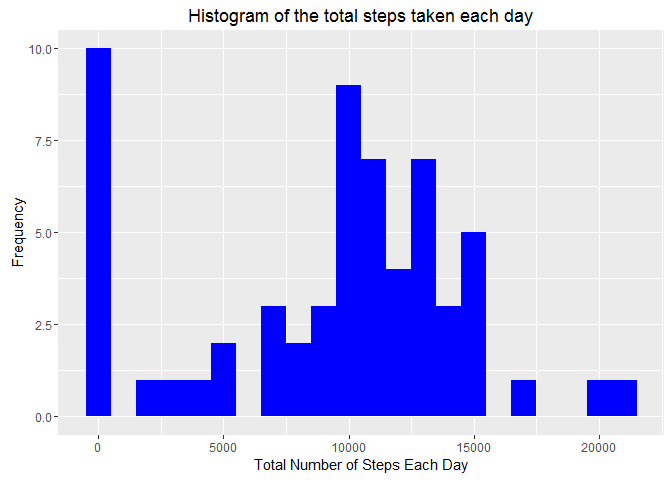
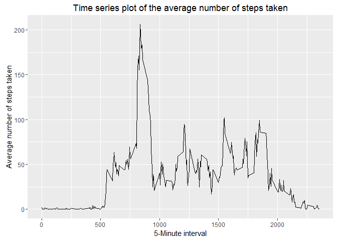
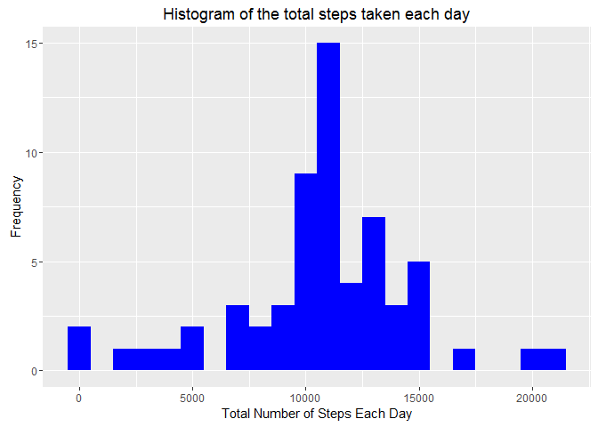
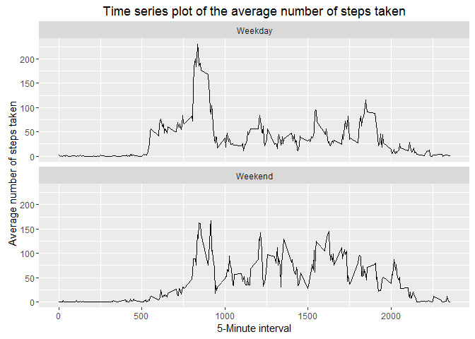

# Reproducible Research: Peer Assessment 1


## Loading and preprocessing the data

This block of code checks if 'activity.csv' exists in the working directory. If not, it downloads the file from the website, unzips and reads in the dataset. 


```r
file.name <- "activity.csv"
url <- "https://d396qusza40orc.cloudfront.net/repdata%2Fdata%2Factivity.zip"
DataZip <- "./activity.zip"

if (!file.exists(file.name)) {
        download.file(url,destfile = DataZip)
        unzip(DataZip)
        file.remove(DataZip)
}
data <- read.csv("activity.csv",header=TRUE)
```

## What is mean total number of steps taken per day?

Find the total number of steps taken per day ignoring missing values.

Plot a histogram of the total number of steps taken each day.

```r
library(ggplot2)
## Total number of steps taken per day.
TotalStepsPerDay <- tapply(data$steps, data$date, FUN=sum, na.rm=TRUE)

## Histogram of the total number of steps taken each day.
PlotA <- qplot(TotalStepsPerDay, binwidth=1000, fill=I("blue"), xlab="Total Number of Steps Each Day", ylab="Frequency", main="Histogram of the total steps taken each day")
print(PlotA)
```

<!-- -->

Mean total number of steps taken per day.

```r
MeanStepsPerDay <- mean(TotalStepsPerDay, na.rm=TRUE)
print(MeanStepsPerDay)
```

```
## [1] 9354.23
```

Median total number of steps taken per day.

```r
MedianStepsPerDay <- median(TotalStepsPerDay, na.rm=TRUE)
print(MedianStepsPerDay)
```

```
## [1] 10395
```

## What is the average daily activity pattern?

Make a time series line graph of the average number of steps taken.

Determine the average number of steps in each interval.

```r
## Time series plot of the average number of steps taken.
library(ggplot2)
AverageSteps <- aggregate(x=list(steps=data$steps), by=list(interval=data$interval), FUN=mean, na.rm=TRUE)
PlotB <- ggplot(data=AverageSteps, aes(x=interval, y=steps))+
                geom_line()+
                xlab("5-Minute interval")+
                ylab("Average number of steps taken")+
                ggtitle("Time series plot of the average number of steps taken")
print(PlotB)
```

<!-- -->

The 5 minute interval that contains the highest average number of steps

```r
IntervalWithMostStepsOnAverage <- AverageSteps[which.max(AverageSteps$steps), ]
print(IntervalWithMostStepsOnAverage)
```

```
##     interval    steps
## 104      835 206.1698
```

## Imputing missing values

Find the total number of missing values in the dataset (coded as NA).

```r
MissingData <- is.na(data$steps)
print(table(MissingData))
```

```
## MissingData
## FALSE  TRUE 
## 15264  2304
```

The approach adopted to fill in the missing values is to use the mean value for the 5 minute interval corresponding to the missing value. The rationale is to reduce the bias of using data in other intervals that may show different activity levels.

Function to achieve the strategy for missing values.

```r
## Function that replaces the missing data with the average within that 5 minute interval.
ReplaceValue <- function(steps, interval) {
        filler <- NA
        if (!is.na(steps))
                filler <- c(steps)
        else
                filler <- (AverageSteps[AverageSteps$interval==interval, "steps"])
        return(filler)
}
```

New dataset with missing data filled in is called 'FilledData'. This uses the function defined above.

```r
FilledData <- data
FilledData$steps <- mapply(ReplaceValue, FilledData$steps, FilledData$interval)
```

Plot a histogram of the total number of steps taken each day after missing values are imputed.

```r
library(ggplot2)
TotalSteps <- tapply(FilledData$steps, FilledData$date, FUN=sum)
PlotC <- qplot(TotalSteps, binwidth=1000, fill=I("blue"), xlab="Total Number of Steps Each Day", ylab="Frequency", main="Histogram of the total steps taken each day")
print(PlotC)
```

<!-- -->

Mean total number of steps taken per day after missing values are imputed.

```r
MeanStepsPerDayFilledData <- mean(TotalSteps)
print(MeanStepsPerDayFilledData)
```

```
## [1] 10766.19
```
Median total number of steps taken per day after missing values are imputed.

```r
MedianStepsPerDayFilledData <- median(TotalSteps)
print(MeanStepsPerDayFilledData)
```

```
## [1] 10766.19
```

The removal and replacement of NA with respective averages in their 5 minute interval increases both the mean and median as originally these observations would have contributed 0 by default.

## Are there differences in activity patterns between weekdays and weekends?

Determine whether the date supplied is a 'weekday' or 'weekend' and add an additional variable to the 'FilledData' on this criteria.

```r
## Function that returns whether the date supplied is a weekday or weekend.
WeekdayOrWeekend <- function(date){
        day <- weekdays(date)
        if (day %in% c("Monday", "Tuesday", "Wednesday", "Thursday", "Friday"))
                return("Weekday")
        if (day %in% c("Saturday", "Sunday"))
                return("Weekend")
}
FilledData$date <- as.Date(FilledData$date)
FilledData$day <- sapply(FilledData$date, FUN=WeekdayOrWeekend)
```

Panel line plot of the 5 minute interval (x-axis) and the average number of steps taken, averaged across all weekday days or weekend days (y-axis).


```r
## Panel plot comparing the average steps taken per 5 minute interval across weekdays and weekends.
library(ggplot2)
AverageStepsByDay <- aggregate(steps ~ interval + day, data=FilledData, mean)
PlotD <- ggplot(data=AverageStepsByDay, aes(interval, steps))+
        geom_line()+
        facet_grid(day ~ .)+
        facet_wrap( ~ day, ncol=1)+
        xlab("5-Minute interval")+
        ylab("Average number of steps taken")+
        ggtitle("Time series plot of the average number of steps taken")
print(PlotD)
```

<!-- -->

Overall, there are differences in the step patterns between weekdays and weekends however further study is required to determine if it is statistically significant.
